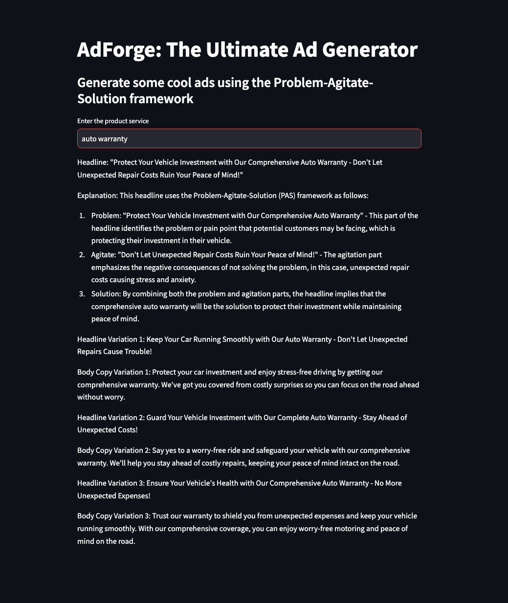

# Supercharge Your Ad Campaigns with your own Local LLM Ad Generator!
[](sample.mov)
<!--  -->

## Welcome to AdForge - Your Local Language Model (LLM) Ad Generator

Are you tired of your paid GPT instance becoming unusable due to persistent unforeseen errors? Say goodbye to those frustrations and welcome the power of Local LLM tasks using Ollama! This project is not just a solution; it's an experience. Now, you can configure your very own local LLM apps and take control of your advertising destiny!

## Table of Contents

- [Introduction](#introduction)
- [Installation](#installation)
- [Usage](#usage)
- [Contributing](#contributing)
- [License](#license)

## Introduction

AdForge is not just an ad generator; it's a game-changer for businesses looking to create engaging advertising campaign creative. Harnessing the Problem-Agitate-Solution (PAS) framework, Adforge uses the incredible trio of Local LLM's, Streamlit, and Langchain to craft compelling headlines and body copy that captivate your audience. I personally use this and many others to save me from hours of mind numbing repetitve work. 

- YES! adforge will generate great advertising headlines as well as body copy.
- YES! it will free up your schedule for more meetings.
- YES! it will absolutely generate variations for your A/B testing. god forbid you should have to use your own brain for advertising.

## Installation

Get ready to embark on an exciting journey with Ollama! Start by installing the necessary packages using Brew:
- I highly recommend using brew and miniconda if you have the mistfortune of apple silicon

```bash
brew install ollama
```

Once Brew has worked its magic, you're just a step away from unleashing the power of Ollama on your local machine.

Ollama will download the model for you if you run it.
```bash
ollama run openhermes
```

Make sure you are using python virtual environments. 
```bash
pip install langchain streamlit langchain-community
```

## Usage

1. **Clone the Repository:**
   ```bash
   git clone https://github.com/e-landeros/adforge.git
   ```

2. **Run the Main Script:**
   ```bash
   cd adforge
   streamlit run app.py
   # the terminal will print out address for your adforge instance
   # http://localhost:8501
   ```

3. **Enter the Product or Service:**
   - Input the name of your product or service when prompted.

4. **Watch the Magic Happen:**
   - Ollama will use its advanced algorithms and the PAS framework to generate a headline and body copy that will leave your audience craving more.

## Contributing

This is just a dumb app I am using to show im not completly useless when it comes to programming thangs. So no support.

## License

Do whatever you want license.

---
